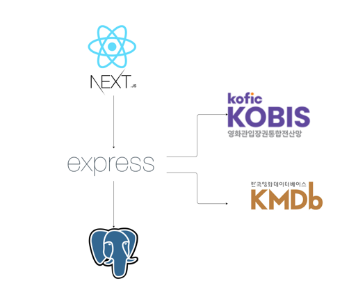

# Movie Community Project
Javascript, Node.js를 이용해 영화 커뮤니티를 구현합니다.

# 계획

주요기술: Javascript, Node.js, express, Next.js, React  


# 실행방법
.env 파일 설정이 필요합니다.

```bash
   git clone https://github.com/jth0809/sideProject.git
   cd sideProject
   docker-compose up
```
